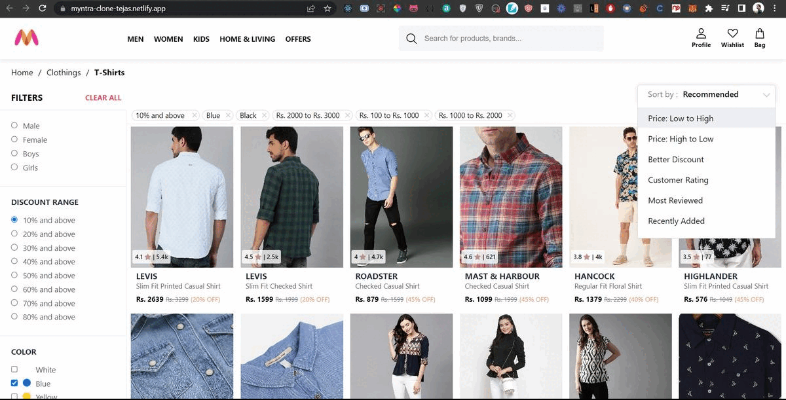

# Myntra Clone
### [Live Link](https://myntra-clone-tejas.netlify.app/)  |  [Video Demo](https://drive.google.com/file/d/1inz0klV3BUnM517INqFhtWN3311-qXE5/view?usp=share_link)
This is a clone of the popular e-commerce platform Myntra. It is a web application built using React, Redux, HTML, and CSS.
<p align="center">
  <a href="https://myntra-clone-tejas.netlify.app/">
    
  </a>
</p>

## Features

The Myntra Clone web app offers the following features:

1. Filters: Users can filter products based on various criteria such as gender, discount range, color, and price. This allows users to narrow down their search and find products that match their preferences.

2. Sort: Users can sort items by price, discount, ratings, and review counts. Sorting options help users find products based on their preferences and make informed purchasing decisions.

3. Bag: Users can add products to their bag or shopping cart. This feature enables users to collect items they wish to purchase and proceed to the checkout process.

4. Wishlist: Users can create a wishlist of their favorite products. This feature allows users to save items for future reference or purchase.

5. View Similar Products: Users can view similar products based on the selected item. This functionality helps users discover alternative options and explore related products.

6. Search Products: Users can search for specific products using keywords or product names. The search functionality makes it easier for users to find desired items quickly.

## Installation

To run the Myntra Clone web app locally, follow these steps:

1. Clone this repository to your local machine. ```git clone https://github.com/tm2k23/myntra.git```
2. Install the necessary dependencies using npm or yarn. ```npm install```
3. Start the development server. ```npm start```
4. Open your web browser and navigate to `http://localhost:3000` to access the Myntra Clone web app.

## Deployment

To deploy the Myntra Clone web app to a production environment, you can follow the deployment guidelines specific to your hosting provider. Remember to build the app before deploying.

```npm run build```


